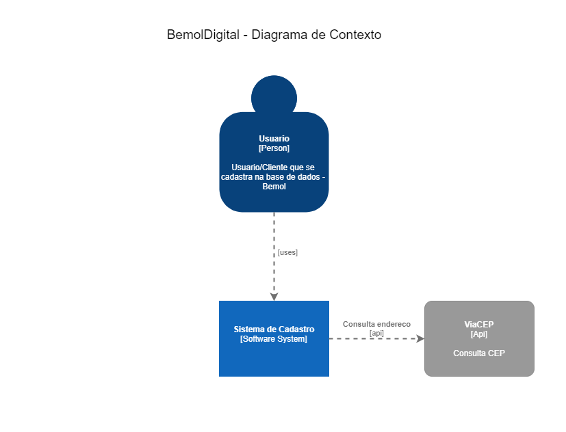
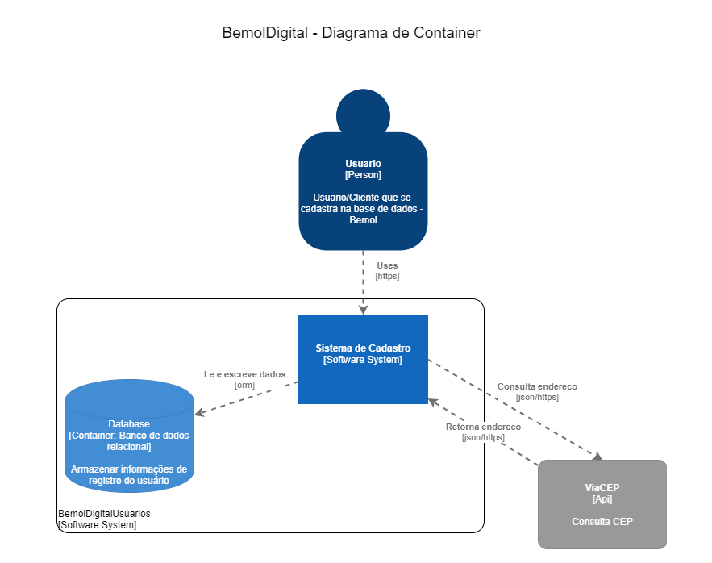
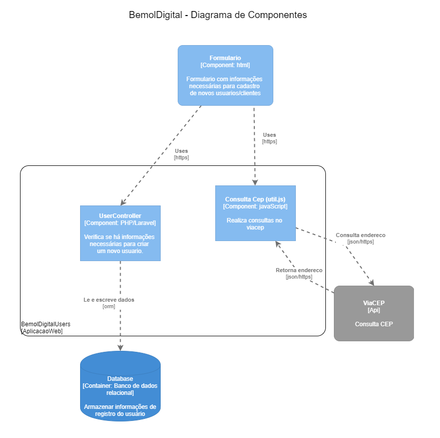

# bemol-digital-users

Projeto resultado do desafio proposto. Formulário simples de cadastro de usuário, consultando o serviço ViaCEP para montar dados de endereço a partir do CEP informado pelo usuário. 

##Tecnologias e Ferramentas utilizadas

- PHP 7.3.10: utilizamos o [Xampp][xampp] que disponibiliza ambiente completo para PHP;
- Mysql;
- Framework [Laravel][laravel] 7.0
- [Composer][composer]: gerenciador de dependencia para o PHP 
- [LaraValidator][validator] Docs: pacote para validacao de documentos
- IDE Visual Studio Code
- Diagramas.net para criação C4 Models 

####Passo a passo para executar o projeto
- Caso você não tenha ambiente de desenvolviemnto PHP disponivel em seu computador, instale o [Xampp][xampp] e após o [Composer][composer].

- Caso tenha o ambiente acima citado, fazer o clone do projeto: 

    - Crie um diretorio para o projeto. Ex: ```mkdir projetoName``` 
    - Acesse o diretorio criado. ```cd projetoName```
    - ```git clone https://github.com/r7alves/bemol-digital-users.git```
    - execute -via cmd- ```composer install``` (no diretório criado :) )
    - execute -via cmd- ```cp .env.example .env```
- Crie o banco de dados (mysql) _bemol_digital_
- Edite o arquivo _.env_ com suas credenciais do banco:
        DB_USERNAME=<kbd>usuario</kbd>  
        DB_PASSWORD=<kbd>senha</kbd>
- Execute -via cmd, no diretorio ```projetoName``` -:
    ```
        php artisan key:generate
        php artisan migrate
        php artisan serve --host=0.0.0.0 --port=80
    ```
- Abra seu navegador e digite:
        http://127.0.0.1

##Diagramas

####Diagrama Contexto



####Diagrama Container



####Diagrama Componentes



[validator]:https://github.com/geekcom/validator-docs
[composer]:https://getcomposer.org/
[xampp]:https://www.apachefriends.org/pt_br/index.html
[laravel]:https://laravel.com/docs/7.x
